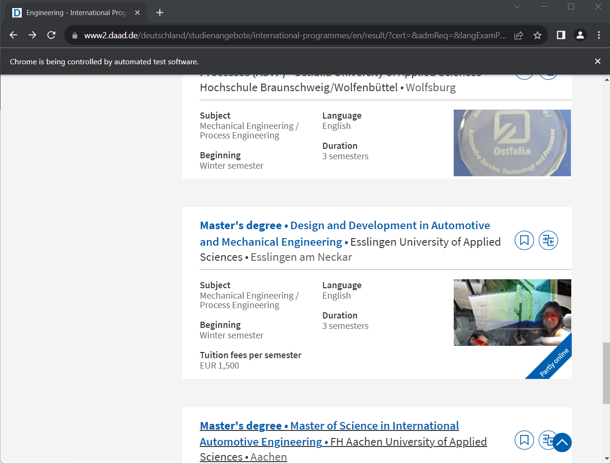
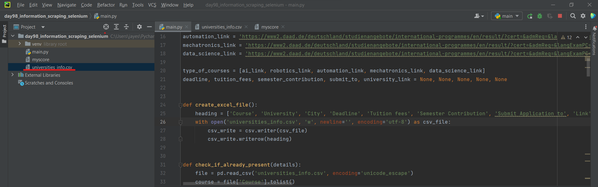

# University Web Scraping Project

This project utilizes Selenium and BeautifulSoup to scrape details from DAAD.de German university websites. The script extracts information such as course name, college, city, tuition fees, link to college website, semester contribution, and application submission details.

## Purpose
The primary objective of this project is to gather comprehensive information about various universities and organize it into an Excel file. The collected data will be presented in a structured format, allowing users to easily access and sort information based on specific criteria. This initiative aims to provide a user-friendly interface for viewers to explore and compare universities efficiently, facilitating informed decision-making. The Excel file will serve as a dynamic repository, enabling users to customize their views and filter data according to their preferences.

## Prerequisites
- Python 3.x installed on your system.
- Selenium and BeautifulSoup libraries installed. You can install them using pip: pip install selenium, pip install beautifulsoup4
- A web driver for your browser (e.g., Chrome or Firefox). Make sure the web driver is compatible with your browser version.
- `chromedriver.exe` (or other web driver files): Required for Selenium to automate web interactions.

## Usage

- Selenium: Used for web automation and interaction with dynamic websites.

- BeautifulSoup: Used for parsing HTML content and extracting relevant data.

- CSV Module: Used to store data scrapped by using bs4 in csv format which can be later used accordingly. 

- Pandas: Used to read CSV file.

### Output
- The script generates a CSV file (output.csv by default) containing the scraped university details.

## Example of Application:

### Web Driver interface (daad.de):

### CSV file download:

### Please Note:
- The elements in the browser may change from time to time and hence we have to rectify the code from time to time if such situation arises.
